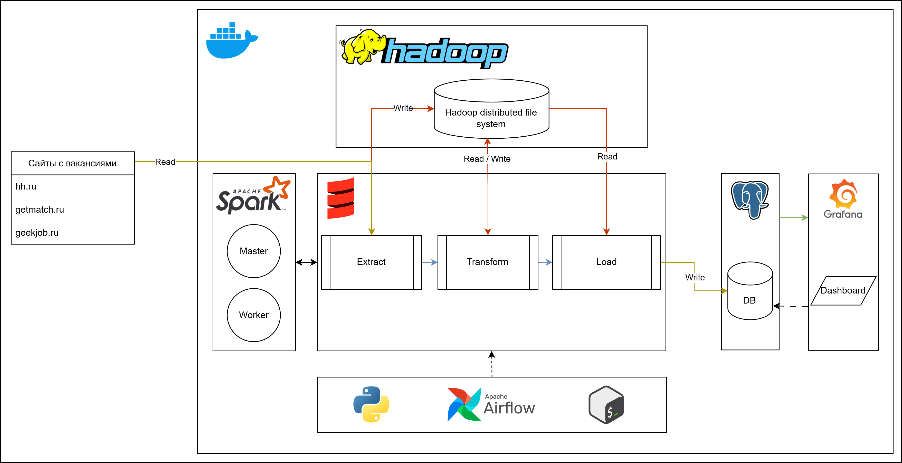
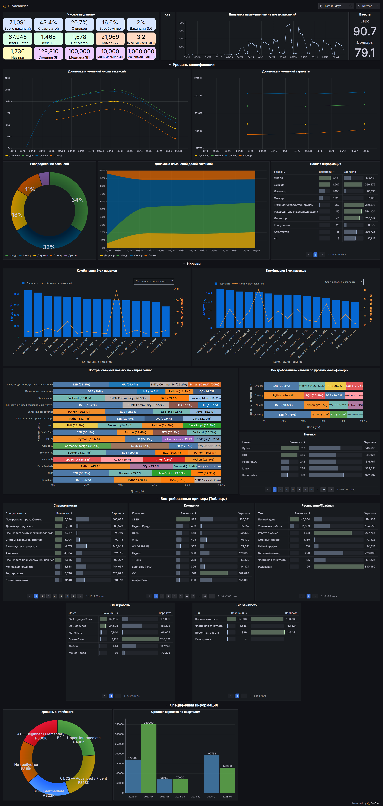

# Автоматизированный ETL-пайплайн для анализа IT-вакансий

Проект представляет собой автоматизированную систему сбора, обработки и анализа данных о вакансиях в IT-сфере с ведущих российских платформ:

- [hh.ru](https://hh.ru)
- [getmatch.ru](https://getmatch.ru)
- [geekjob.ru](https://geekjob.ru)

Система агрегирует данные и предоставляет аналитические отчёты в виде интерактивных дашбордов, помогая соискателям определять перспективные направления для развития в IT-индустрии. 

**Ключевая ценность проекта** — предоставление актуальной аналитики IT-рынка труда и персонализированных рекомендаций для специалистов.

## ⚙️ Технический стек

### **🟦Scala** *2.12.18* (Ядро проекта)

#### Используемые библиотеки

- **Apache Spark Core/SQL 3.5.4** — Распределённая обработка и анализ структурированных данных
- **Typesafe Config 1.4.3** — Управление конфигурациями
- **Scallop 5.2.0** — Парсинг аргументов командной строки
- **STTP Client 3.10.1** — HTTP-запросы к API
- **PostgreSQL JDBC 42.7.4** — Взаимодействие с БД
- **Scala Scraper 2.2.1** — Парсинг HTML/XML 

---

### **🟦Spark** - *3.5.4*
Кластер из master- и одного worker-узлов для распределённой обработки данных.

---

### **🟦Hadoop** - *3.3.5*
Распределённое хранилище с namenode и одной datanode для промежуточного хранения сырых и обработанных данных.

---

### **🟦Postgres** - *17*
Основное хранилище структурированных данных с материализованными представлениями для аналитики.

---

### **🟦Grafana** - *11.6.1*
Визуализация аналитических отчётов через интерактивные дашборды.

---

### **🟦Airflow** - *2.10.2*
Оркестрация ETL-процессов по расписанию.

---

## Архитектура решения

---

### Реализация DAGs в Airflow
---

### 🟪 Сбор данных
**DAG для парсинга вакансий, справочников и курсов валют**

**Задачи:**
1. **Extract (SparkSubmitOperator)**
   - Получение данных через API/веб-скрапинг
   - Сохранение сырых данных в HDFS
2. **Transform (SparkSubmitOperator)**
   - Очистка, нормализация и преобразование данных
   - Стандартизация форматов
   - Сохранение обработанных данных в HDFS в формате paquet
3. **Load (SparkSubmitOperator)**
   - Загрузка финальных данных в PostgreSQL

---

### 🟪 Агрегация данных
**DAG для обновления аналитических представлений**

**Задача:**
- **Refresh Materialized View (PostgresOperator)**
  - Актуализация материализованных представлений

---

### 🟪 Очистка данных
**DAG для управления хранилищем**

**Задача:**
- **Clean HDFS (BashOperator/PythonOperator)**
  - Удаление устаревших данных по расписанию

---

## Ключевые проблемы и решения

### 🔧 Оптимизация управления конфигурациями
**Проблема:** Жёстко закодированные параметры требовали перекомпиляции для изменений  
**Решение:** Иерархическая система конфигурационных файлов (.conf) с наследованием общих параметров

### 🔧 Стандартизация валютных значений
**Проблема:** Разнородные форматы валют на разных платформах  
**Решение:** Унификация форматов на этапе Transform с привязкой к курсам hh.ru

### 🔧 Борьба с дубликатами
**Проблема:** Повторяющиеся записи в PostgreSQL  
**Решение:** Оптимизированная вставка через `INSERT ON CONFLICT` вместо триггеров

### 🔧 Оптимизация DAG в Airflow  
**Проблема:** В DAG было много повторяющихся задач с одинаковой логикой, что приводило к дублированию кода. Зависимости между группами задач были прописаны вручную, из-за чего граф выполнения становился громоздким и сложным для поддержки.  
**Решение:** Задачи автоматически генерируются в циклах на основе входных данных, что устраняет дублирование кода. Для управления зависимостями между группами задач добавлены промежуточные задачи-маркеры, что делает DAG более гибким и читаемым.

---

## Результаты

Данный этап разработки является самым началом. 

Проект требует добавления большего количества платформ для сбора данных. На данный момент количество собираемых данных в день ~ `11 MB` (~ `4000 вакансий` в рабочий день), с учетом дубликатов. Это крайне малое значение и требует много времени для получения внушаемого количества данных и качественного анализа рынка. Так например за `23` дня было собрано только `71,000` вакансий.

*Данные полученные за 23 дня*

Использование grafana является не лучшим выбором для визуализации данных такого рода (для подобного лучше подойдет SuperSet или MetaBase).

Также агрегируемые данные и их отображение требуют сильного изменения. По графикам и данным трудно провести полный анализ IT рынка, а человеку сложно сказать какое направление ему лучше выбрать (а это является главной целью проекта).

## Заключение

Проект успешно реализован и демонстрирует полную работоспособность. Готовая инфраструктура может быть развернута с использованием Docker, что обеспечивает удобство deployment'а и масштабируемости.  

### Перспективы развития  
Для дальнейшего улучшения проекта предусмотрены следующие направления доработок:  

- **Расширение источников данных** – интеграция дополнительных платформ для сбора информации  

- **Оптимизация визуализации** – переход на более удобный и функциональный интерфейс представления аналитики  
- **Улучшение обработки данных** – доработка механизмов агрегации и нормализации для повышения точности анализа рынка  
- **Внедрение мониторинга** – настройка системы отслеживания состояния сервисов (например, через Grafana + Prometheus)  

### Приобретенные навыки  
В ходе разработки проекта были освоены и применены на практике следующие технологии и инструменты:  
- **Оркестрация данных** – настройка и управление ETL-процессами с помощью Apache Airflow  
- **Работа с Big Data** – обработка больших объемов данных в распределенных системах (Hadoop, Spark)  
- **Функциональное программирование** – разработка скриптов и программ на Scala
- **Контейнеризация** – развертывание сервисов через Docker, управление образами и контейнерами  
- **Администрирование ОС** – работа в Linux (настройка окружения, управление процессами, shell-скриптинг)  
- **Визуализация данных** – создание дашбордов и метрик в Grafana 

- **Работа с базами данных** – проектирование схемы, оптимизация запросов и взаимодействие с PostgreSQL  
- **Разработка на Python** – написание скриптов для обработки данных и автоматизации задач  
- **Работа с конфигурациями** – управление настройками сервисов через конфигурационные файлы (`YAML`, `JSON`, `.env`, `.conf`)  

Проект позволил получить ценный опыт в построении end-to-end решений для сбора и анализа данных, а также продемонстрировал способность работать с комплексными distributed-системами.